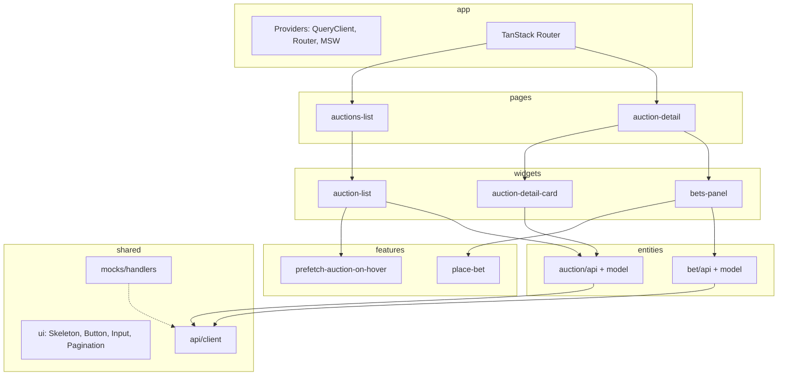

# SPA грузовых аукционов (FSD + MSW)

## Текущее состояние

Проект — стартовый Vite-шаблон с готовым контрактом и зависимостями, но без прикладной логики:


| Готово                                                                         | Не реализовано    |
| ------------------------------------------------------------------------------ | ----------------- |
| [data/openapi.auctions.v0.json](data/openapi.auctions.v0.json) — 4 эндпоинта   | FSD-слои          |
| [src/api/api.ts](src/api/api.ts) — сгенерированные типы                        | MSW handlers      |
| [src/api/client.ts](src/api/client.ts) — openapi-fetch (placeholder `baseUrl`) | Router, Query, UI |


**Важно:** path-параметр `{auctionUuid}` соответствует полю `main.order_uid` в ответах API (единственный UUID в схемах).

## Целевая архитектура (FSD)




### Структура каталогов

```
src/
  app/
    providers/          # QueryClientProvider, RouterProvider
    routes/             # routeTree, lazy pages
    styles/             # global.css, variables.css (BEM tokens)
    index.tsx           # bootstrap + MSW init
  pages/
    auctions-list/      # композиция widgets
    auction-detail/
  widgets/
    auction-list/
    auction-detail-card/
    bets-panel/
  features/
    prefetch-auction-on-hover/
    place-bet/
  entities/
    auction/
      api/              # listAuctions, getAuction + query keys
      model/            # типы-алиасы из components.schemas
      ui/               # AuctionCard (presentational)
    bet/
      api/              # listBets, setBet
      model/
      ui/               # BetRow
  shared/
    api/client.ts       # перенести из src/api/
    api/types.ts        # реэкспорт components из api.ts
    ui/                 # Skeleton, Button, Input, Pagination, ErrorState
    lib/                # formatPrice, formatDate
    mocks/
      browser.ts        # setupWorker
      handlers/         # auctions.ts, bets.ts
      data/             # fixtures + in-memory store
```

Существующий [src/api/](src/api/) переезжает в `shared/api/`; корневой [src/main.tsx](src/main.tsx) заменяется на `app/index.tsx`.

## Маршруты


| URL                      | Страница               | Содержимое                                 |
| ------------------------ | ---------------------- | ------------------------------------------ |
| `/`                      | redirect → `/auctions` | —                                          |
| `/auctions`              | `pages/auctions-list`  | список + пагинация                         |
| `/auctions/$auctionUuid` | `pages/auction-detail` | карточка аукциона + история ставок + форма |


TanStack Router — **code-based** (без `@tanstack/router-plugin`, его нет в deps). Loader на detail-странице для `getAuction` + `listBets`.

## Data layer

### API client

Исправить `baseUrl` в [src/api/client.ts](src/api/client.ts):

```ts
export const client = createClient<paths>({ baseUrl: '/api/v1' });
```

Vite proxy в [vite.config.ts](vite.config.ts) не обязателен — MSW перехватывает `/api/v1/*` в dev.

### React Query keys

```ts
// entities/auction/api/queries.ts
['auctions', 'list', { page, perPage }]
['auctions', 'detail', auctionUuid]

// entities/bet/api/queries.ts
['bets', auctionUuid]
```

### Prefetch on hover

В `features/prefetch-auction-on-hover` — хук `usePrefetchAuction(uuid)`:

- `onMouseEnter` на карточке списка → `queryClient.prefetchQuery({ queryKey: ['auctions','detail', uuid], queryFn })`
- `staleTime: 30_000` — повторный hover не дёргает сеть

## MSW mocks

1. `npx msw init public/` — service worker
2. Handlers по путям из OpenAPI (`/api/v1/auctions/...`):


| Handler                     | Логика                                                                                     |
| --------------------------- | ------------------------------------------------------------------------------------------ |
| `POST /auctions/list`       | фильтрация in-memory массива, пагинация `page`/`per_page`, ответ `{ data, meta }`          |
| `GET /auctions/:uuid`       | 404 если uuid не найден                                                                    |
| `GET /auctions/:uuid/bets`  | ставки из Map `uuid → BetItem[]`, сортировка по `created_at` desc                          |
| `POST /auctions/:uuid/bets` | валидация `price > 0` → 422; append ставки; обновить `trading.current_price` в detail/list |


1. **Fixtures:** ~30 аукционов с разными `auc_type`, `status`, маршрутами (from/to города), 0–5 ставок на аукцион
2. Искусственная задержка `delay(300–600ms)` для демонстрации skeleton
3. MSW стартует только в dev (`import.meta.env.DEV`)

## UI (Plain CSS / BEM)

Глобальные CSS-переменные в `app/styles/variables.css` (цвета, spacing, typography). Каждый компонент — co-located `.css` с BEM:

```css
.auction-card { }
.auction-card__route { }
.auction-card__price { }
.auction-card--leading { }
```

### Страница списка (`/auctions`)

**Widget `auction-list`:**

- `useQuery` с `page` из search-параметра `?page=1`
- **Skeleton:** 6 карточек `.skeleton` (shared/ui) пока `isLoading`
- **Карточка** (`entities/auction/ui/AuctionCard`): маршрут from→to, организатор, тип аукциона, текущая цена, статус, `Link` на detail
- **Pagination** (shared/ui): prev/next + номера страниц из `meta.current_page` / `meta.last_page`
- Hover → prefetch detail

### Страница детали (`/auctions/$auctionUuid`)

**Widget `auction-detail-card`:**

- Секции: main (номер груза, тип), organizer, cargo (вес/объём), routes (точки), trading (статус, время, текущая/ваша ставка), payment
- Skeleton на время загрузки; ErrorState при 404

**Widget `bets-panel`:**

- Таблица/список ставок: дата, контакт, цена с/без НДС
- Скрыть историю если `hide_bets_history === true` (показать заглушку)
- **Feature `place-bet`:** форма (react-hook-form + zod: `price > 0`), disabled если `trading.can_set_bet === false`
- `useMutation(setBet)` → invalidate `['bets', uuid]` + `['auctions', 'detail', uuid]`

## Конфигурация

### Path alias `@/` → `src/`

[vite.config.ts](vite.config.ts):

```ts
resolve: { alias: { '@': path.resolve(__dirname, 'src') } }
```

[tsconfig.app.json](tsconfig.app.json):

```json
"paths": { "@/*": ["./src/*"] }
```

### Bootstrap ([src/app/index.tsx](src/app/index.tsx))

```ts
async function enableMocking() {
  if (import.meta.env.DEV) {
    const { worker } = await import('@/shared/mocks/browser');
    return worker.start({ onUnhandledRequest: 'bypass' });
  }
}
enableMocking().then(() => createRoot(...).render(<AppProviders />));
```

## Порядок реализации

```mermaid
flowchart LR
  S1[1. Infra: alias, FSD dirs, providers] --> S2[2. shared/api + MSW fixtures]
  S2 --> S3[3. entities: auction + bet API/queries]
  S3 --> S4[4. shared/ui: Skeleton, Pagination, form controls]
  S4 --> S5[5. pages + widgets: list with pagination]
  S5 --> S6[6. prefetch-on-hover feature]
  S6 --> S7[7. detail page + bets-panel + place-bet]
  S7 --> S8[8. Polish: errors, empty states, lint/build]
```




## Что сознательно вне scope

- Фильтры списка (`status`, `sort`, `is_oldest` из `AuctionListRequest`) — только пагинация
- Auth / 401 handling
- Real-time обновление ставок (polling/WebSocket)
- Unit/E2E тесты (если не запросите отдельно)

## Проверка готовности

- `npm run dev` — MSW активен, список грузится со skeleton
- Пагинация переключает страницы, meta корректна
- Hover на карточке → detail открывается без задержки (prefetch)
- Detail показывает все ключевые секции; 404 для несуществующего uuid
- Форма ставки валидирует price, после submit список ставок обновляется
- `npm run build` — без TS/lint ошибок

